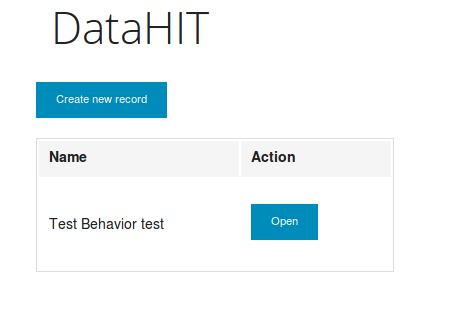
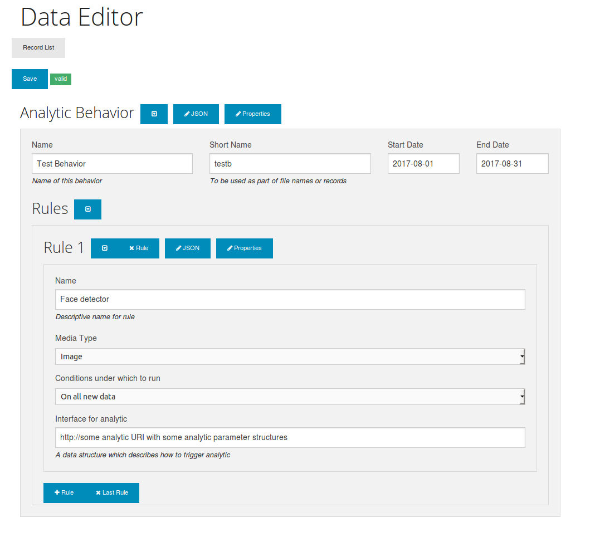

# DataHIT
Data Human Intelligence Task

DataHIT is a single function tool which can be used to solicit and validate structured data (JSON) from humans working on a collaborative project and store it in an ElasticSearch index where it can be accessed by machines.

## Roadmap
This was written with identity management and permissions in mind, but it is not fully implemented yet. I may or may not get around to doing that.

## Screenshots

## Running
1. Install ElasticSearch [docs here](https://www.digitalocean.com/community/tutorials/how-to-install-and-configure-elasticsearch-on-ubuntu-16-04)
2. sudo pip install -r requirements.txt
3. edit config.yaml to point to ElasticSearch
4. ./datahit.py
5. Go to http://127.0.0.1:31338/list
6. After it runs, go ahead and edit the schemas in static/schemas/default-schema.json (JSON Schema version 3 and 4) as well as default-data.json to suit data gathering tasks.

### JSON Schema references
http://json-schema.org/latest/json-schema-core.html  
http://json-schema.org/latest/json-schema-validation.html  

## Acknowledgements

h/t to Jeremy Dorn for a great javascript json editor and validator - https://github.com/jdorn/json-editor/  
For advanced use and customization of the validator, see this project and it's examples.
